# UI redizaina atskaite (ui-redesign pret ui-ux-overhaul)

Datums: 2026-10-07. Zari: `ui-ux-overhaul` (UI/UX audits + labojumi) un `ui-redesign` (vizuālais redizains, balstīts uz `ui-ux-overhaul`). `main` nav aiztikts.

## Preview vides

| Zars | Preview URL | Commits |
|---|---|---|
| ui-ux-overhaul (A, "pirms") | https://anabellaparty-c9vclem2e-infoailabspace-7279s-projects.vercel.app | `396ee70` |
| ui-redesign (B, "pēc") | https://anabellaparty-fcki6vuix-infoailabspace-7279s-projects.vercel.app | `f1eae66` |

Abas vides ir aizsargātas ar Vercel Authentication. Preview izmanto **produkcijas Supabase** (`uewpetpyckpuzqywtcmf`), tāpēc preview testos formas netika iesniegtas.

## Mērījumu metode

- Viss mērīts uz preview URL (Vercel CDN), nevis lokāli. Piekļuvei izmantotas īslaicīgas `?_vercel_share` saites; abām vidēm ir vienāds pāradresācijas sods.
- Lighthouse 12, mobile, 3 mērījumu mediāna. Mērījumi notika pārmaiņus: katrai lapai A, tad B, 3 kārtās, lai tīkla svārstības abas vides skar vienādi.
- axe-core (WCAG 2.0/2.1/2.2 A+AA + best-practice), 375 un 1280 px. Mērītas visas publiskās LV lapas un EN/RU paraugi.
- SEO 61/69 abām vidēm ir vienāds un nāk no Vercel preview `x-robots-tag: noindex`, nevis no koda. Produkcijā SEO ir 92-100.

## Lighthouse (mobile, mediāna no 3)

| Lapa | Performance A → B | Accessibility A → B | Best Practices A → B | SEO A → B | LCP A → B | TBT A → B | CLS A → B |
|---|---|---|---|---|---|---|---|
| / | 75 → 77 (+2) | 100 → 100 | 93 → 93 | 61 → 61 | 5,4 s → 5,4 s | 162 → 126 ms | 0,000 → 0,000 |
| /foto-kaste/ | 75 → 77 (+2) | 100 → 100 | 93 → 93 | 61 → 61 | 5,2 s → 5,2 s | 202 → 101 ms | 0,000 → 0,005 |
| /svinibu-inventars/specefekti/ | 73 → 76 (+3) | 100 → 100 | 93 → 93 | 61 → 61 | 4,8 s → 5,1 s | 334 → 166 ms | 0,000 → 0,000 |
| /rezervet/ | 74 → 77 (+3) | 100 → 100 | 93 → 93 | 61 → 61 | 4,6 s → 4,9 s | 366 → 184 ms | 0,000 → 0,000 |
| /kontakti/ | 63 → 71 (+8) | 100 → 100 | 93 → 93 | 61 → 61 | 5,5 s → 5,7 s | 457 → 170 ms | 0,000 → 0,000 |
| /noteikumi/ | 71 → 80 (+9) | 100 → 100 | 93 → 93 | 69 → 69 | 4,2 s → 4,5 s | 549 → 172 ms | 0,000 → 0,000 |

Kvalitātes slieksnis ir izpildīts: Accessibility un Performance nevienā lapā nav zemāki par ui-ux-overhaul. Lielākie ieguvumi ir TBT samazinājums, jo izņemtas globālā fona tekstūra, efektu komponentes un fona video sākumlapā. LCP atšķirības (+0,2-0,3 s) ir simulētā lēnā 4G trokšņa robežās; CLS paliek ~0.

## axe un citas pārbaudes (ui-redesign preview)

| Pārbaude | Rezultāts |
|---|---|
| axe, 26 lapas (19 LV + 7 EN/RU), 375 un 1280 px | **0 pārkāpumu** (0 kritisku) |
| Ar atslēgtu JS, 17 lapas | **0** slēptu teksta elementu |
| Sīkdatņu josla pret hero CTA (375x812, 360x640, 390x844, LV/RU) | neaizsedz nevienā |
| `<html lang>` servera HTML (/, /en/, /ru/, /admin/login) | lv / en / ru / lv |
| Maršruti: /llms.txt, /robots.txt, /sitemap.xml, /blogs/rss.xml, ikonas, /og-image.jpg, esošs bloga raksts, /en/ un /ru/ lapas | visi 200 ar pareizu content-type |
| 404: /neeksiste/, /en/neeksiste/, /ru/neeksiste/, /foto-kaste/neeksiste/ | HTTP 404; pārlūkā lokalizēta 404 lapa ar pareizu lang un navigāciju |

## Ekrānuzņēmumi (pirms = ui-ux-overhaul, pēc = ui-redesign)

Uzņemti no preview, sīkdatņu josla aizvērta; redzami pirmie divi ekrāni.

### Sākumlapa

| 375 pirms | 375 pēc |
|---|---|
| 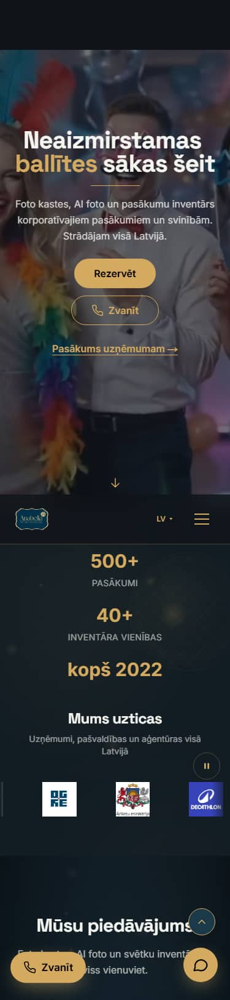 | 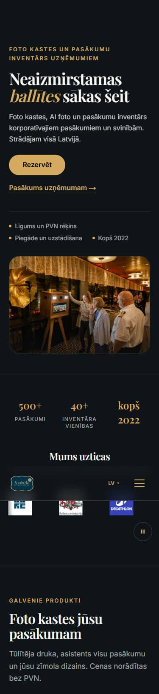 |

| 1440 pirms | 1440 pēc |
|---|---|
| 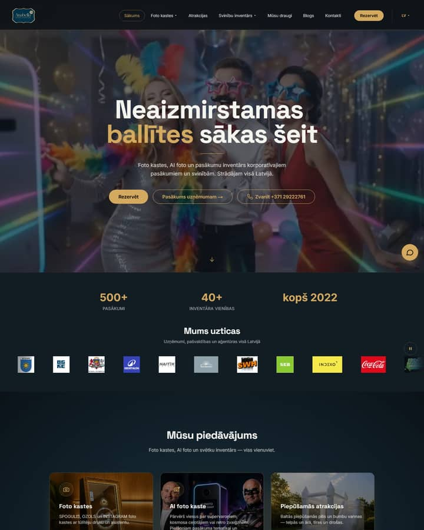 | 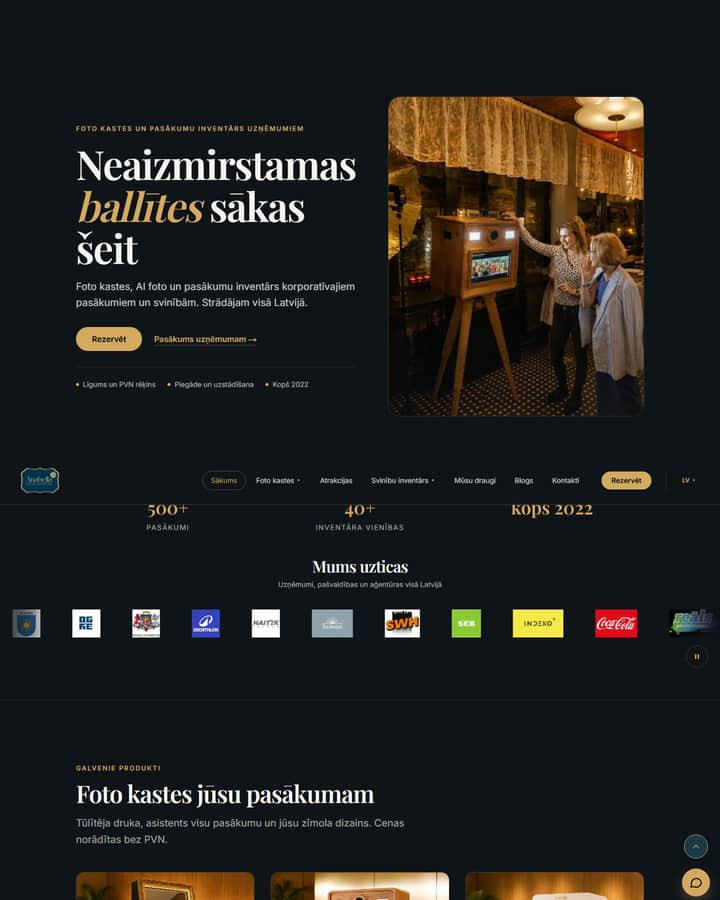 |

### Foto kaste (/foto-kaste/)

| 375 pirms | 375 pēc |
|---|---|
| 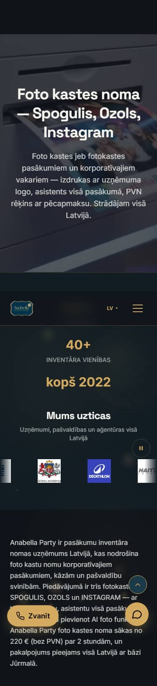 | 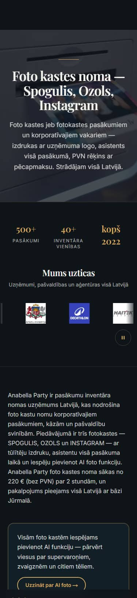 |

| 1440 pirms | 1440 pēc |
|---|---|
| 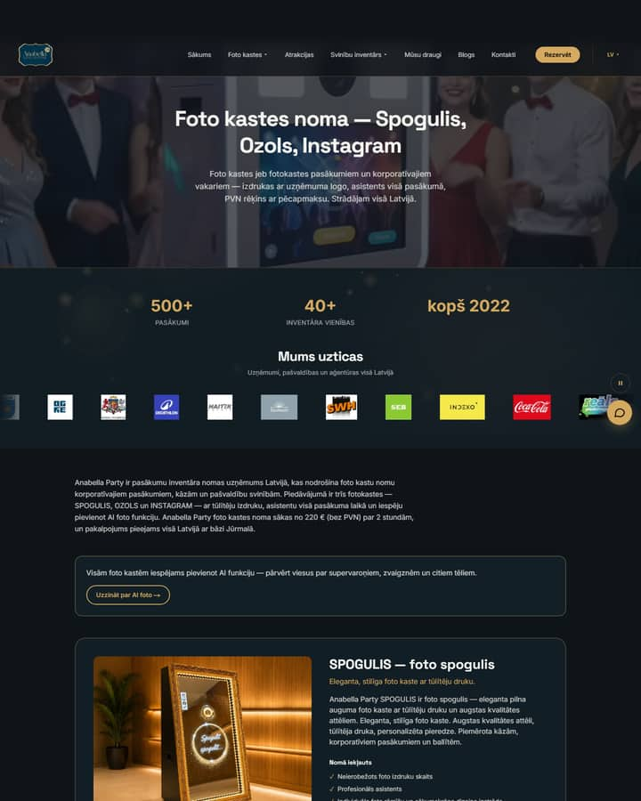 | 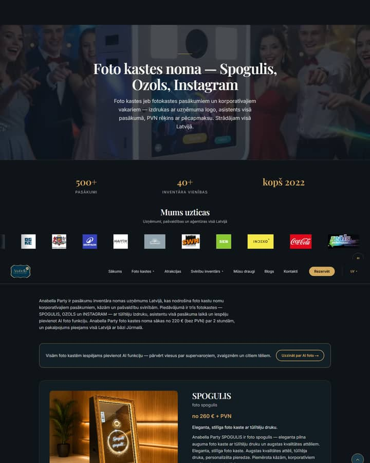 |

### Produkta lapa (/svinibu-inventars/specefekti/)

| 375 pirms | 375 pēc |
|---|---|
| 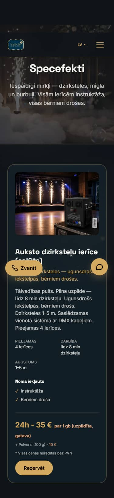 | 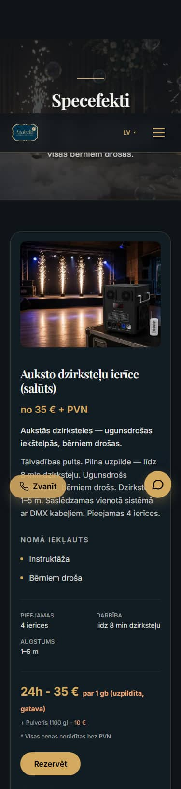 |

| 1440 pirms | 1440 pēc |
|---|---|
| 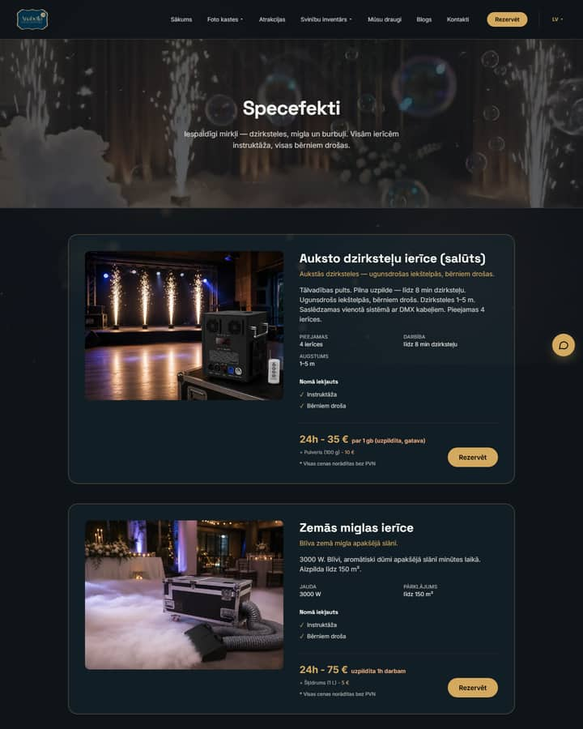 | 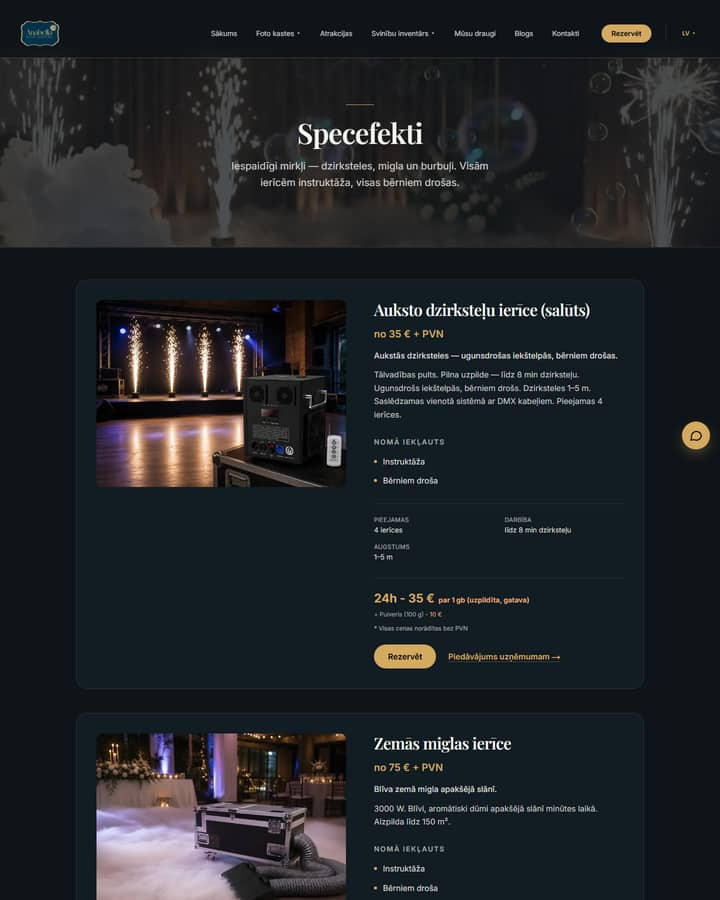 |

### Rezervācija (/rezervet/)

| 375 pirms | 375 pēc |
|---|---|
| 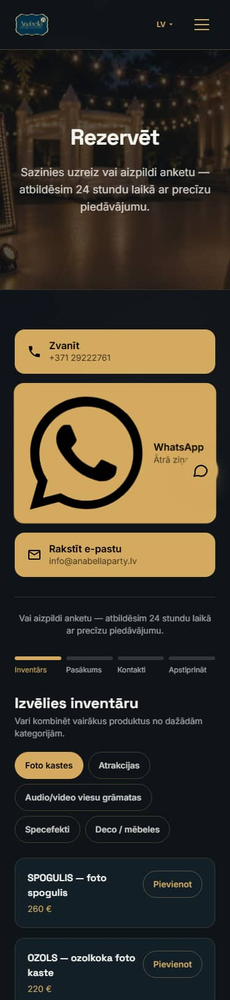 | 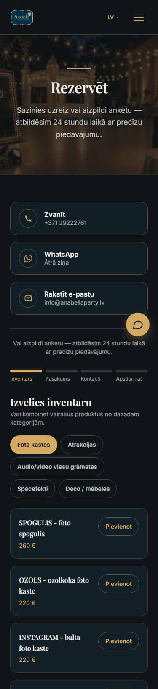 |

| 1440 pirms | 1440 pēc |
|---|---|
| 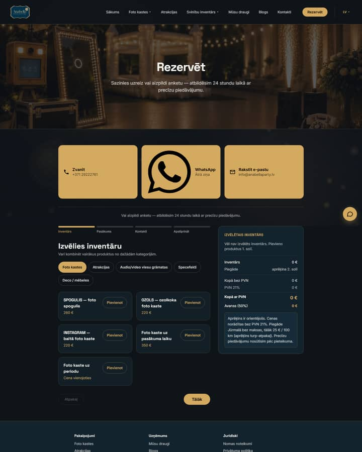 | 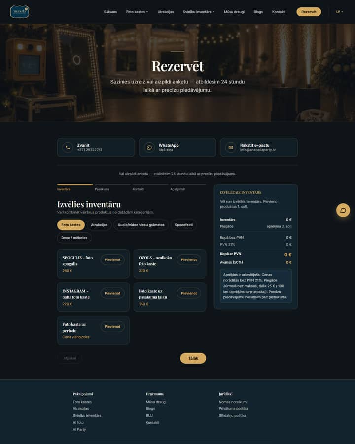 |

### Kontakti (/kontakti/)

| 375 pirms | 375 pēc |
|---|---|
| 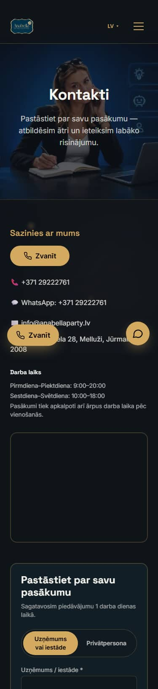 | 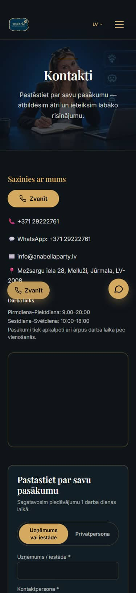 |

| 1440 pirms | 1440 pēc |
|---|---|
| 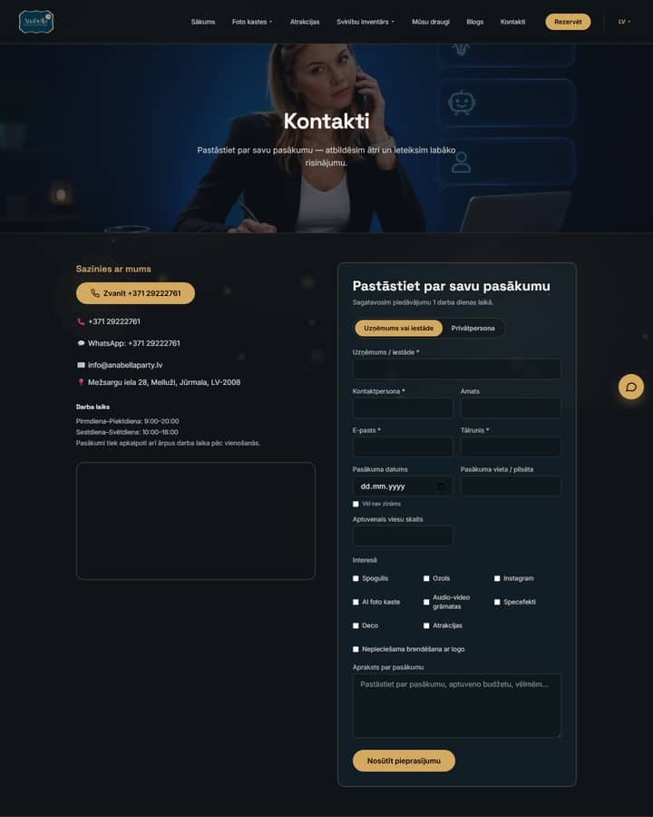 | 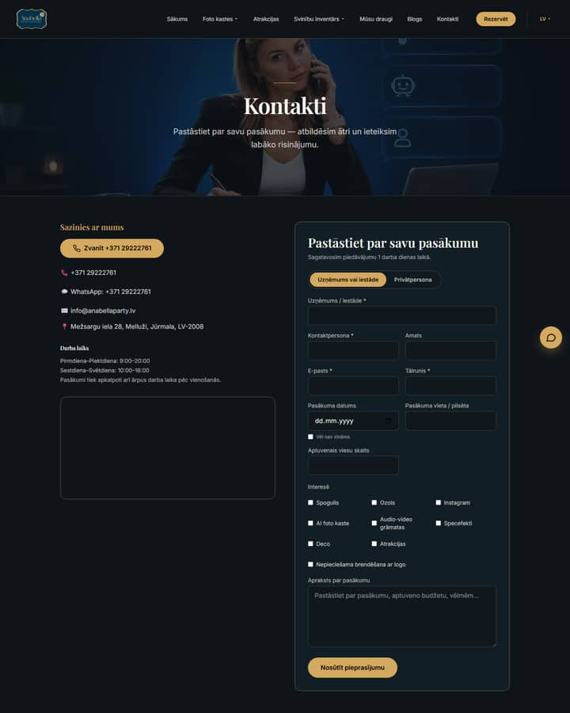 |

## Kas mainīts (redizains)

- **Tipogrāfija.** Display fonts ir Playfair Display (latin, latin-ext un kirilica, pēdējā bez preload). Body paliek Inter. Ieviesta skala display/H1/H2/H3/card/lead (`app/tokens.css`). Admin paliek Space Grotesk.
- **Ritms.** Vienots sekciju vertikālais solis `--section-y`, satura konteiners 76rem ar gutter, `eyebrow` virsrakstu uzraksti.
- **Efekti.** Izņemti: globālā dreifējošā tekstūra, dziļuma fons, shimmer, glow-pulse, float, čata pulss, WhatsApp lēkāšana, `hover:scale` un zelta glow ēnas. Zelts paliek akcentam: līnijas, CTA, punkti.
- **Sākumlapa.** Secība: hero, uzticības josla, galvenie produkti, Uzņēmumiem (4 soļi + pašvaldības), galerija, atsauksmes, par mums, FAQ, noslēguma CTA.
- **Produktu lapas.** Vienots izkārtojums. Cena "no X € + PVN" atrodas zem virsraksta, redzamas 4 galvenās priekšrocības, primārais CTA ar `?item=` un sekundārā B2B saite.
- **Saglabāts bez izmaiņām:** URL, metadati, JSON-LD, hreflang, llms.txt, AEO/GEO rindkopas, rezervācijas loģika, ORS kalkulators un bezmaksas piegādes zona.

## Mainītie virsraksti un teksti (pirms → pēc)

### Sākumlapa (commit 93599a9)

| Vieta | Pirms | Pēc |
|---|---|---|
| Hero eyebrow | (nebija) | "Foto kastes un pasākumu inventārs uzņēmumiem" |
| Hero H1 | "Neaizmirstamas ballītes sākas šeit" (DB) | nemainīts; vārds "ballītes" kursīvā zeltā |
| Hero apakšvirsraksts | DB teksts | nemainīts |
| Hero CTA | "Rezervēt" + "Pasākums uzņēmumam →" (tikai desktopā) + "Zvanīt" | "Rezervēt" + "Pasākums uzņēmumam →" (visos platumos); zvana poga izņemta no hero (paliek peldošā un noslēguma CTA) |
| Hero uzticības rinda | (nebija) | "Līgums un PVN rēķins" · "Piegāde un uzstādīšana" · "Kopš 2022" |
| Hero foto alt | (fona video, dekoratīvs) | "Ozola foto kaste korporatīvā vakarā - viesi apskata izdrukas" |
| Produktu sekcija H2 | "Mūsu piedāvājums" | eyebrow "Galvenie produkti" + H2 "Foto kastes jūsu pasākumam" |
| Produktu sekcijas ievads | "Foto kastes, AI foto un svētku inventārs — viss vienuviet." | "Tūlītēja druka, asistents visu pasākumu un jūsu zīmola dizains. Cenas norādītas bez PVN." |
| Produktu kartīte | kategorijas kartīte ar "Apskatīt →" | modelis ("SPOGULIS") + tips ("foto spogulis"), "no 260 € + PVN", 4 priekšrocības, "Rezervēt" + "Uzzināt vairāk" |
| Pārējās kategorijas | 7 kartītes | saišu rinda "Viss inventārs" |
| Uzņēmumiem eyebrow | (nebija) | "Uzņēmumiem un iestādēm" |
| Uzņēmumiem H2 | "Pasākums uzņēmumam vai iestādei" | nemainīts |
| Sadarbības process | (nebija; atsevišķs bloks "Kā tas notiek": Izvēlieties / Pieprasiet / Mēs atbraucam) | H3 "Kā notiek sadarbība": 1. Pieprasījums, 2. Piedāvājums, 3. Līgums un rēķins, 4. Piegāde un uzstādīšana (ar aprakstiem) |
| B2B foto alt | (nebija) | "Koka foto kaste uzņēmuma pasākumā ar zīmola fonu" |
| FAQ sākumlapā | (nebija) | eyebrow "Biežāk uzdotie jautājumi", H2 "Atbildes uz svarīgāko", saite "Visi jautājumi →" |
| Noslēguma CTA | teksti nemainīti | nemainīti (mainīts tikai izskats) |

Visi jaunie teksti ir LV/EN/RU (`messages/*.json`: `home.*`, `forBusiness.*`).

### Produktu lapas (commit 057022f)

| Vieta | Pirms | Pēc |
|---|---|---|
| Produkta virsraksts | "SPOGULIS — foto spogulis" | H2 "SPOGULIS" + apakšrinda "foto spogulis" (DB nosaukums nemainīts) |
| Cena | tikai tarifu blokā | papildus "no 260 € + PVN" zem virsraksta |
| Iekļautā saraksts | viss saraksts | 4 galvenie punkti + "Vairāk iekļautā (n)" |
| Sekundārais CTA | (nebija) | "Piedāvājums uzņēmumam →" |
| Rezervācijas formā un cenu panelī | "SPOGULIS — foto spogulis" | "SPOGULIS - foto spogulis" (tikai attēlojums) |

### ui-ux-overhaul teksti (commits 6e7e8a5, 141d1cd)

| Vieta | Pirms | Pēc |
|---|---|---|
| Sīkdatņu josla | tikai LV, garš teksts | LV/EN/RU; mobilajā īss "Izmantojam sīkdatnes." + "Sīkdatņu politika · Iestatījumi" |
| Skip link | (nebija) | "Pāriet uz saturu" / "Skip to content" / "Перейти к содержанию" |
| Zvana un "uz augšu" pogas | tikai LV | LV/EN/RU |
| Hero mobilajā | B2B saite paslēpta | "Pasākums uzņēmumam →" redzama |
| UI teksti | 113 garās domuzīmes komponentēs | "-" (metadatos un AEO tekstos nemainīts) |

## Nelabotie punkti

1. **404 bez JS ir tukša.** Next atgriež HTTP 404 un pārlūks ar JS renderē pareizu lokalizētu 404 lapu (lang, navigācija). Servera HTML tomēr ir Next `__next_error__` apvalks. Produkcijā tā bija jau iepriekš. Novēršanai vajag eksperimentālo `globalNotFound` un 404 apstrādes pārbūvi.
2. **`/admin/neeksiste`** neautorizētam lietotājam ir 307 uz `/admin/login` (apzināta auth aizsardzība). Autorizētam lietotājam tas ir 404 caur `app/not-found.tsx` ar `lang="lv"`. Ar autorizāciju tas nav pārbaudīts, jo nav admin piekļuves.
3. **Garās domuzīmes saturā, kas nav jāmaina:** metadati, AEO/GEO teksti (piem., /foto-kaste/ H1 "Foto kastes noma — Spogulis, Ozols, Instagram"), DB produktu nosaukumi, `messages` teksti (piem., pašvaldību bloks). Attēlošanā produktu nosaukumi tiek sadalīti vai aizstāti ar "-".
4. **Hero H1 "Neaizmirstamas ballītes sākas šeit"** glabājas DB (`site_content`). Preview raksta produkcijas DB, tāpēc teksts nav mainīts. Ieteikums B2B auditorijai: mainīt adminā, piem., "Foto kastes un pasākumu inventārs uzņēmumiem".
5. **Kontaktu karte** /kontakti/ lapā redzama kā tukšs rāmis, kamēr nav sīkdatņu piekrišanas (esoša uzvedība).
6. **`/null` 404 logos** (pieminēts auditā): avots kodā un saturā nav atrasts, visticamāk ārējs rāpulis.

## Piezīmes

- **Bezmaksas piegādes zona:** `lib/delivery.ts:12` (`FREE_ZONE = "Jūrmalas valstspilsēta"`), `lib/delivery.ts:305` (nosaukumi `jurmala`, `jurmalas valstspilseta`) un `lib/delivery.ts:18` (rezerves rādiuss 16 km). Spēkā kopš commita `3e78f80` (2026-09-30, `git log -S`). Iepriekš: "Ķekavas novads", 15 km.
- Preview vides raksta produkcijas Supabase. Vienīgais formas tests (ui-ux-overhaul preview, 2026-10-05) tika veikts ar testa datiem, un ieraksti pēc tam tika izdzēsti.
